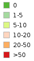

## Tree cover loss

### Tree cover loss legend

Tree cover loss monthly estimates, derived from Sentinel-1 polarimetry
SAR data pre-processed with SAGRIS production system
(http://www.sagris.eu), cover all scenarios of natural and man-made 
causes of the loss of trees, including natural tree fall due to aging,
severe storms, forestry maintenance activities, as well as legal or
illegal timber production. This service has high sensitivity (minimum
mapping unit - 100 sq.m) and temporal frequency (monthly updates during
summer) with additional periodic assessment of the whole summer season
(months 05-09, 2024). Vector map of forestry taxation units shows
percentage of area indicating tree loss.
